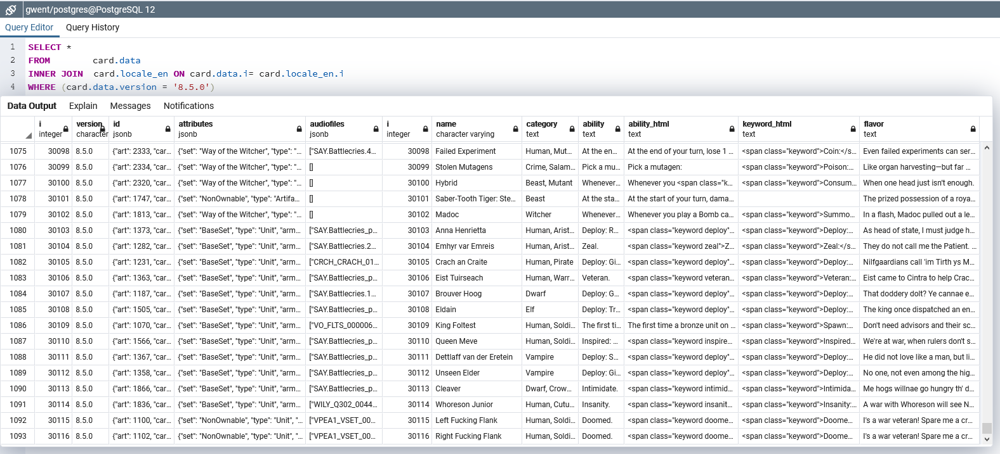

# Gwent One Database

## What is this?
A PostgreSQL card database for the game Gwent. This database gives you access to all of the card versions since the official release (2018-10-23). The data is available in 12 languages.

## API
If you do not want a full PostgreSQL database you can grab the card data from the gwent.one api
```
documentation     - https://api.gwent.one                 
english only data - https://api.gwent.one?key=data        
all language data - https://api.gwent.one?key=data&language=all
```

## Requirements
1. Postgres installation
2. PHP installation with pdo_pgsql installed and enabled
3. Localization available here: [GwentLocalization](https://github.com/teddybee-r/GwentLocalization "github.com/teddybee-r/GwentLocalization")  

### Setup
1. Adjust the database variables in the config folder to connect to your postgres server.
2. run 'php bin/database' in your terminal


### 2022-08-30 Update
Added tests, and more options, some code rewrite  

### Benchmark
```
Tested on:

Ryzen 2600, Windows 10, PHP 7.4, Postgres 12
Time: ~160s
i5-7500T, Fedora Server 36, Podman: (php:8.1-fpm (8.1.9), postgres:latest (14.5))
Time: ~840s
Intel Atom N2800 (2c/4t 1.86GHz), Ubuntu 18.04, Docker: (php:fpm, postgres:12)
Time: ~6800s ~110min

using 'php bin/database => 1'
52 version inserts (up to 10.8.0)
```

```
php bin/database

  _|_|_|    _|  PostgreSQL Gwent Database
_|        _|_|               by gwent.one
_|  _|_|    _|
_|    _|    _|  Database: gwent
  _|_|_|    _|  Schema:   card


--- First Time Setup ---
 1. Build database structure and insert data
 2. Build database structure
 3. Insert data: Every version

--- Update DB ---
11. Insert data: Single version
12. Insert data: Only current version
##  ^ Inserts the latest and deletes previous versions

--- Reset Changelog ---
21. Truncate changelog and insert data
##  ^ Changelog data gets updated for previous versions sometimes

--- Delete DB --
99. Drop Database

Enter one of the above numbers: 1

=> Database: gwent
=> Schema: card
=> Table: card.data
=> Table: card.changelog
=> Table: card.locale_cn _de _en _es _fr _it _jp _kr _mx _pl _pt _ru


  _|_|_|    _|  Depending on the hardware
_|        _|_|  this may take a while!
_|  _|_|    _|
_|    _|    _|  Inserting 52 version(s)
  _|_|_|    _|       with 12 locale(s)

   Version      Cards   Time
=> 1.0.0.15     524     1.75s
=> ...          ...     ...
=> 10.8.0       1260    4.1s
=> Insert Data: Changelog

=> Total Time:165.34s


php bin/test
Test passed :: Tables have the same number of entries: 49096
Test passed :: Tables match the number of locales configured: 12
Test passed :: Tables match the number of versions configured: 52
Test passed :: The last entry matches the latest version (10.8.0)
```

# Database (pgadmin)


# PHP postgres example
This query gives full card data of a single id.  
card.data are jsonb fields so we need to decode them later.

```php
$version = '8.0.0';
$id      = 202308;

$pdo = new PDO("pgsql:host=$database_server;dbname=$database_name", $database_user, $database_pass);
$sql = "
        SELECT *     
        FROM        card.data
        INNER JOIN  card.locale_en ON card.data.i= card.locale_en.i
        WHERE (card.data.version = :version AND card.data.id->'card' = :id)
        ";
$stmt = $pdo->prepare($sql);
$stmt->bindParam(':version', $version);
$stmt->bindParam(':id', $id);
$stmt->execute();

//             OBJECTS $card->name
$card = $stmt->fetch(PDO::FETCH_OBJ);

$attr         = json_decode($card->attributes);
$ids          = json_decode($card->id);
$id           = $ids->card;
$art          = $ids->art;
$audio        = $ids->audio;
$name         = $card->name;
$category     = $card->category;
$ability      = $card->ability_html;
$keywords     = $card->keyword_html;
$flavor       = $card->flavor;
$faction      = $attr->faction;
$faction2     = $attr->factionSecondary;
$set          = $attr->set;
$color        = $attr->color;
$type         = $attr->type;
$rarity       = $attr->rarity;
$power        = $attr->power;
$armor        = $attr->armor;
$provision    = $attr->provision;
$reach	      = $attr->reach;
```

```php
$version = '8.0.0';
$pdo = new PDO("pgsql:host=$database_server;dbname=$database_name", $database_user, $database_pass);

$sql="
SELECT 
data.id->>'card' AS id,
data.id->>'art'  AS artid,
data.attributes->>'set'              AS availability,
data.attributes->>'type'             AS type,
data.attributes->>'power'            AS power,
data.attributes->>'provision'        AS provision,
data.attributes->>'armor'            AS armor,
data.attributes->>'reach'            AS reach,
data.attributes->>'color'            AS color,
data.attributes->>'rarity'           AS rarity,
data.attributes->>'faction'          AS faction,
data.attributes->>'factionSecondary' AS factionSecondary,
data.attributes->>'related'          AS related,
data.attributes->>'artist'           AS artist,
data.version,

locale_cn.name         AS         name_cn,
locale_cn.category     AS     category_cn,
locale_cn.ability      AS      ability_cn,
locale_cn.ability_html AS ability_html_cn,
locale_cn.keyword_html AS keyword_html_cn,
locale_cn.flavor       AS       flavor_cn,

locale_de.name         AS         name_de,
locale_de.category     AS     category_de,
locale_de.ability      AS      ability_de,
locale_de.ability_html AS ability_html_de,
locale_de.keyword_html AS keyword_html_de,
locale_de.flavor       AS       flavor_de,

locale_en.name         AS         name_en,
locale_en.category     AS     category_en,
locale_en.ability      AS      ability_en,
locale_en.ability_html AS ability_html_en,
locale_en.keyword_html AS keyword_html_en,
locale_en.flavor       AS       flavor_en,

locale_es.name         AS         name_es,
locale_es.category     AS     category_es,
locale_es.ability      AS      ability_es,
locale_es.ability_html AS ability_html_es,
locale_es.keyword_html AS keyword_html_es,
locale_es.flavor       AS       flavor_es,

locale_fr.name         AS         name_fr,
locale_fr.category     AS     category_fr,
locale_fr.ability      AS      ability_fr,
locale_fr.ability_html AS ability_html_fr,
locale_fr.keyword_html AS keyword_html_fr,
locale_fr.flavor       AS       flavor_fr,

locale_it.name         AS         name_it,
locale_it.category     AS     category_it,
locale_it.ability      AS      ability_it,
locale_it.ability_html AS ability_html_it,
locale_it.keyword_html AS keyword_html_it,
locale_it.flavor       AS       flavor_it,

locale_jp.name         AS         name_jp,
locale_jp.category     AS     category_jp,
locale_jp.ability      AS      ability_jp,
locale_jp.ability_html AS ability_html_jp,
locale_jp.keyword_html AS keyword_html_jp,
locale_jp.flavor       AS       flavor_jp,

locale_kr.name         AS         name_kr,
locale_kr.category     AS     category_kr,
locale_kr.ability      AS      ability_kr,
locale_kr.ability_html AS ability_html_kr,
locale_kr.keyword_html AS keyword_html_kr,
locale_kr.flavor       AS       flavor_kr,

locale_mx.name         AS         name_mx,
locale_mx.category     AS     category_mx,
locale_mx.ability      AS      ability_mx,
locale_mx.ability_html AS ability_html_mx,
locale_mx.keyword_html AS keyword_html_mx,
locale_mx.flavor       AS       flavor_mx,

locale_pl.name         AS         name_pl,
locale_pl.category     AS     category_pl,
locale_pl.ability      AS      ability_pl,
locale_pl.ability_html AS ability_html_pl,
locale_pl.keyword_html AS keyword_html_pl,
locale_pl.flavor       AS       flavor_pl,

locale_pt.name         AS         name_pt,
locale_pt.category     AS     category_pt,
locale_pt.ability      AS      ability_pt,
locale_pt.ability_html AS ability_html_pt,
locale_pt.keyword_html AS keyword_html_pt,
locale_pt.flavor       AS       flavor_pt,

locale_ru.name         AS         name_ru,
locale_ru.category     AS     category_ru,
locale_ru.ability      AS      ability_ru,
locale_ru.ability_html AS ability_html_ru,
locale_ru.keyword_html AS keyword_html_ru,
locale_ru.flavor       AS       flavor_ru

FROM        card.data
INNER JOIN  card.locale_cn ON card.locale_cn.i = card.data.i
INNER JOIN  card.locale_en ON card.locale_en.i = card.data.i
INNER JOIN  card.locale_es ON card.locale_es.i = card.data.i
INNER JOIN  card.locale_de ON card.locale_de.i = card.data.i
INNER JOIN  card.locale_fr ON card.locale_fr.i = card.data.i
INNER JOIN  card.locale_it ON card.locale_it.i = card.data.i
INNER JOIN  card.locale_jp ON card.locale_jp.i = card.data.i
INNER JOIN  card.locale_kr ON card.locale_kr.i = card.data.i
INNER JOIN  card.locale_mx ON card.locale_mx.i = card.data.i
INNER JOIN  card.locale_pl ON card.locale_pl.i = card.data.i
INNER JOIN  card.locale_pt ON card.locale_pt.i = card.data.i
INNER JOIN  card.locale_ru ON card.locale_ru.i = card.data.i
WHERE       card.data.version = :version
ORDER BY    card.data.i
";
$stmt = $pdo->prepare($sql);
$stmt->bindParam(':version', $version);
$stmt->execute();

//              ARRAYS $cards["name"]
$cards = $stmt->fetchAll(PDO::FETCH_ASSOC);
```